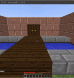
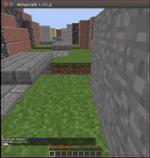
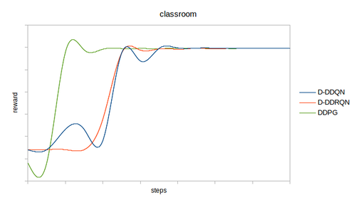

# MalmoRL
A framework for training Reinforcement Learning agents in Minecraft with [Project Malmö](https://github.com/Microsoft/malmo). I've built it for my own research and I hope it's useful to others as well. It is partially based on code provided with the [The Malmo Collaborative AI Challenge](https://github.com/Microsoft/malmo-challenge), extended to support more Malmö mission environments. It should also be easy to extend further to support the needs of more environments.   

Work in progress...

### Define a mission
Create `missions/<your_mission>.py`. Inside it you must define 3 classses: 
1. `Mission`, where you should define at least the `mission_name` the `agent_names` and the `mission_xml` description.

2. `MissionEnvironment`, where you should define at least the available `actions` in the environment. You can optionally define several other aspects of the environment, like how you want actions sent by the agent to be handled etc. by overriding the respective methods.

3. `MissionStateBuilder`, where you can define the states (frames, observations etc.) produced by the environment. You must override the `build()` method to create and return states to the agent.

Take a look at the included `missions/classroom.py` and `missions/multi_agent.py` for more concrete examples.

### Define an agent
New agents should extend `BaseAgent` and override `fit()`, `test()`, `save()` and `load()` methods for training, testing, saving and loading the agent respectively. You can look at the included agents in `malmo_rl` for examples.

### Run an experiment
You can look at the included `run_classroom.py` and `run_multi_agent.py` for how to make your own script for your custom experiment but you don't necessarily have to follow them. The scripts expect a list of clients defined in `clients.txt`. There must be at least as many clients as there are agents in the mission.

### Use included agents
`malmo_rl` includes 3 agents based on my fork of [keras-rl](https://github.com/petrosgk/keras-rl):
1. Random agent
2. Double Dueling DQN (D-DDQN) with recurrent network support
3. Deep Deterministic Policy Gradient (DDPG) with recurrent network support

You can run `classroom_train_dqn.sh` or `classroom_train_ddpg.sh` to train DQN and DDPG respectively on the Classroom mission. You can also run `multi_agent_random.sh` to test a mission with 2 random agents and an overhead observer.

### Requirements
- Python 2.7 or 3.5
- [Project Malmö](https://github.com/Microsoft/malmo)
- (Optional) [keras-rl](https://github.com/petrosgk/keras-rl)
